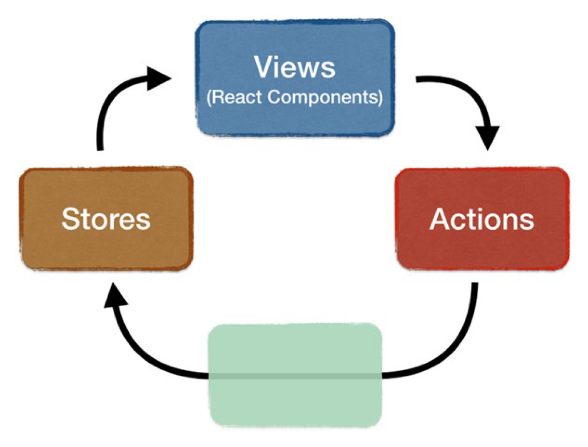
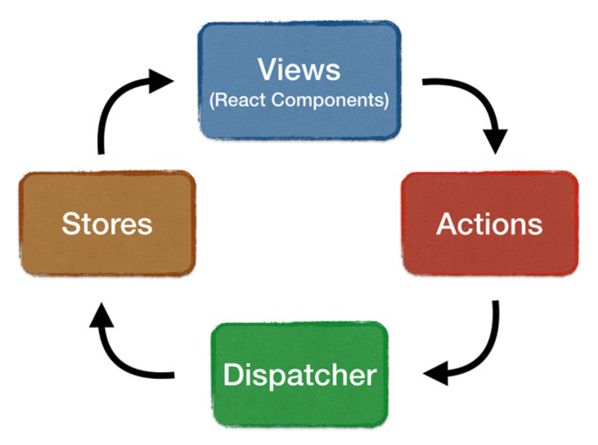

# 06. 플럭스를 이용한 리액트 애플리케이션 설계

## 플럭스란?

웹 애플리케이션을 개발하기 위한 아키텍처 가이드라인으로서 페이스북에서 만들었다.

핵심 개념: 단방향 흐름 지원

### 스토어

스토어는 애플리케이션의 모든 상태(데이터와 UI상태를 포함)를 유지하여

상태가 변경되면 이벤트를 dispatch한다.

뷰(리액트 컴포넌트)는 필요한 데이터를 포함하는 스토어를 구독하며 데이터가 변경되면 자신을 다시 렌더링한다.

스토어는 데이터에 접근하기 위한 getter method를 제공하지만,

뷰는 물론이고 플럭스의 다른 부분에서도 스토어의 데이터를 변경, 갱신, 삽입할 수 없다.

`스토어 자체만 데이터를 변경`할 수 있다.

### 액션

`앱에서 일어나는 일`

애플리케이션의 거의 모든 부분에서 생성될 수 있으며, 사용자 상호작용(예: 버튼 클릭, 댓글 달기, 검색 결과 요청 등)에서 주로 생성되지만

AJAX 요청, 타이머, 웹소켓 이벤트 등을 통해서도 생성된다.

 스토어는 액션이 발송되면 자신의 데이터를 업데이트한다.

### 디스패처

디스패처는 액션을 스토어로 전달하는 과정을 조율하고 스토어의 액션 핸들러가 올바른 순서로 실행되도록 관리한다.

