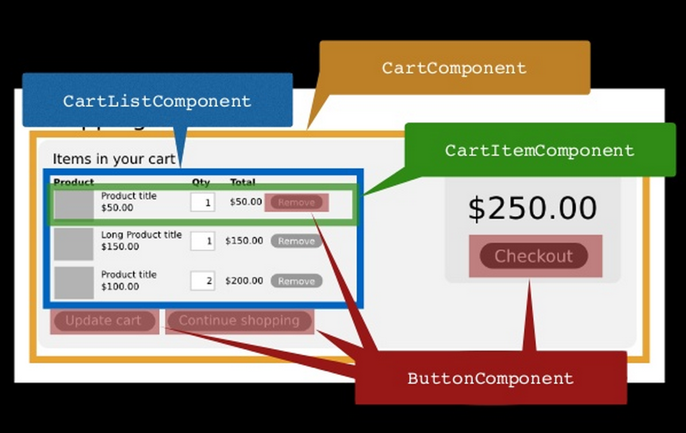
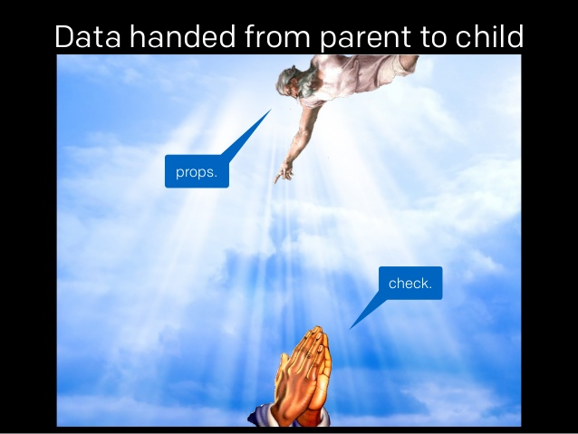
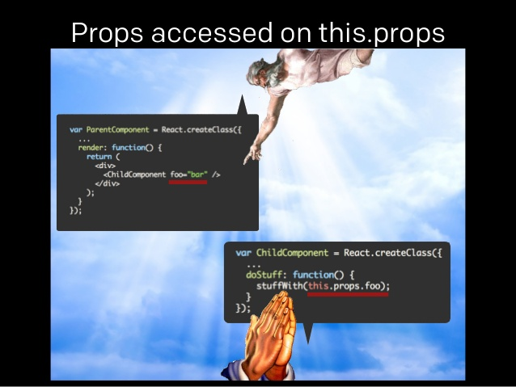
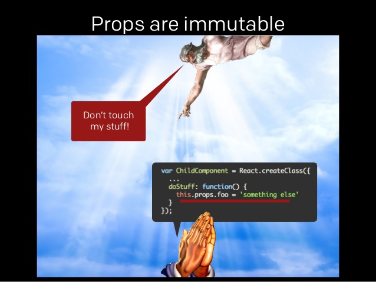
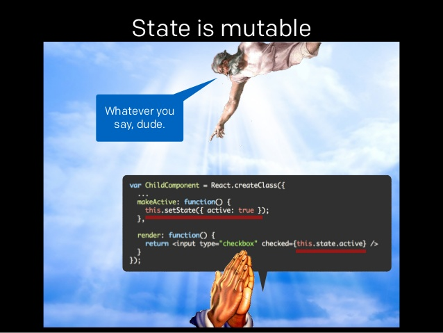

# Getting started

React is a JavaScript library for building user interfaces.

## 장점

### Just Components
주로 MVC의 View로 React를 사용 (타 framework 사용 가능)

재사용이 가능한 Component



### Virtual DOM
- 순수 Javascript
- 빠르다(메모리상에 DOM을 구성하고 업데이트된 부분만 갱신)
- 변화가 생겼을 시 render() 호출

### 1-way data flow





## 단점

View만 처리할 수 있기 때문에 React 자체의 learning curve는 낮은 편이지만,

router, model 등 타 framework와의 조합 필요

## Examples

JSX
```js
var CommentBox = React.createClass({
  render: function() {
    return (
      <div className="commentBox">
        Hello, world! I am a CommentBox.
      </div>
    );
  }
});
ReactDOM.render(
  <CommentBox />,
  document.getElementById('content')
);
```

Plain JavaScript
```js
var CommentBox = React.createClass({displayName: 'CommentBox',
  render: function() {
    return (
      React.createElement('div', {className: "commentBox"},
        "Hello, world! I am a CommentBox."
      )
    );
  }
});
ReactDOM.render(
  React.createElement(CommentBox, null),
  document.getElementById('content')
);
```

`render()` HTML로 rendering될 React Component의 Tree를 return

<div> 태그는 실제 DOM이 아니고 React div component를 초기화한다.
React가 처리할 수 있는 data의 한 조각이다.

`ReactDOM.render()` 두번째 인자로 받은 DOM에 component markup을 주입. copmonent들이 정의되고 난 후에만 호출 가능.

## 함께 익히면 좋은 기술들

* **Redux:** data와 UI의 state를 관리.
* **Webpack:** module bundler
* **Babel:** Transform Compiler
* **ES6:** ECMAScript 2015 :+1:
